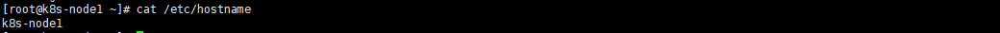

# k8s

该demo用于介绍kubernetes集群如何搭建,资源如何获取,以及提供相关的软件包以及镜像

并且提供了client-go的demo用于调用k8s集群

## 相关软件以及镜像

链接：https://pan.baidu.com/s/1Z52hPgWqYS0qSCTCsbYeKw 
提取码：wnob

## Centos7搭建kubernetes-v1.23.1集群

由于kubernetes集群要求机器最少两核心以上,而我的云服务器都是1核1GB的,所以这次采用虚拟机搭建kubernetes集群,并且保证每台虚拟机都在2核2GB配置及以上

### ISO镜像信息

镜像为Centos7-1908最小镜像:


### 安装前准备

#### 解决网络不可达

因为最小镜像安装,并没有打开网卡开关,使用网络时会出现网络不可达报错信息


解决方法:

修改**/etc/sysconfig/network-scripts/ifcfg-ens33**的onboot选项为yes,然后重启网络

ifcfg-ens33这个文件名和你的网卡有关,可能也叫其他名


```bash
#修改onboot=yes
vi /etc/sysconfig/network-scripts/ifcfg-ens33
#重启网络
service network restart
```

#### 更换Yum源

如果使用官方源安装软件包过慢的可以选择更换yum源,这里使用的是阿里源

```bash
#备份原yum源文件
mv /etc/yum.repos.d/CentOS-Base.repo /etc/yum.repos.d/CentOS-Base.repo.bak
#下载阿里镜像源文件
wget -O /etc/yum.repos.d/CentOS-Base.repo http://mirrors.aliyun.com/repo/Centos-7.repo
#最小镜像如果没有wget工具则使用curl
curl -o /etc/yum.repos.d/CentOS-Base.repo http://mirrors.aliyun.com/repo/Centos-7.repo
#清除原有缓存
yum clean all
#生成新缓存
yum makecache
```

#### 修改DNS以及配置静态IP

如果是虚拟机搭建,并且使用NAT网络,并不需要此步骤

```bash
vi /etc/sysconfig/network-scripts/ifcfg-ens33
#修改以下内容
#BOOTPROTO=static
#IPADDR=xxx.xxx.xx.xxx
#NETMASK=xxx.xxx.xxx.xxx
#GATEWAY=xxx.xxx.xxx.xxx
#DNS1=xxx.xxx.xxx.xxx
#DNS2=xxx.xxx.xxx.xxx

#重启网络
systemctl restart NetworkManager
```

#### 其他工具安装

安装自己喜欢的一些工具,也可以不安

```bash
#安装网络工具
yum install net-tools
#安装vim
yum install vim
#安装ssh
yum install openssh-server
```

### 安装包的获取

#### 配置EPEL

由于官方仓库的rpm包资源不够丰富,而且为了稳定,大多为老版本,所以安装EPEL,获取最新的软件包

```bash
#安装epel
yum install -y epel-release.noarch
#查看源列表
yum repolist
```

#### 安装yum工具

```bash
#安装yum工具,使用yum-config-manager操作资源库(对资源库的增删改查)
#资源库即/etc/yum.repos.d/文件夹下的文件
yum -y install yum-utils
```

#### Docker 安装包的获取

##### 安装Docker源

```bash
yum-config-manager --add-repo=https://download.docker.com/linux/centos/docker-ce.repo
```

##### 下载Docker相关软件包

```bash
mkdir ~/docker
cd ~/docker
yumdownloader --resolve docker-ce
```

结果如图:


#### Kubernetes安装包的获取

##### 配置Kubernetes源

/etc/yum.repos.d/目录下增加 kubernetes.repo 文件

- 如果你可以访问Google的话,文件内容如下

  ```
  [kubernetes]
  name=Kubernetes
  baseurl=https://packages.cloud.google.com/yum/repos/kubernetes-el7-x86_64
  enabled=1
  gpgcheck=1
  repo_gpgcheck=1
  gpgkey=https://packages.cloud.google.com/yum/doc/yum-key.gpg https://packages.cloud.google.com/yum/doc/rpm-package-key.gpg
  ```

- 如果不能Google,则使用阿里源,文件内容如下

  [阿里官方Kubernetes源使用介绍地址](https://developer.aliyun.com/mirror/kubernetes?spm=a2c6h.13651102.0.0.3e221b11HHHf68)

  ```
  [kubernetes]
  name=Kubernetes
  baseurl=https://mirrors.aliyun.com/kubernetes/yum/repos/kubernetes-el7-x86_64/
  enabled=1
  gpgcheck=1
  repo_gpgcheck=1
  gpgkey=https://mirrors.aliyun.com/kubernetes/yum/doc/yum-key.gpg https://mirrors.aliyun.com/kubernetes/yum/doc/rpm-package-key.gpg
  ```

##### 下载Kubernetes相关软件包

```bash
mkdir ~/k8s
cd ~/k8s
yumdownloader --resolve kubelet kubeadm kubectl

#若使用阿里镜像由于官网未开放同步方式, 可能会有索引gpg检查失败的情况这时使用 
yum install -y --nogpgcheck kubelet kubeadm kubectl
```

结果如图:


### 开始安装

#### 修改主机名

为了区分集群中的每一个节点的名称,建议修改主机名用于区分

```bash
vim /etc/hostname
```

主节点:


从节点:

#### 关闭防火墙并且禁用开机自启

```bash
systemctl stop firewalld  
systemctl disable firewalld
```

#### 关闭 selinux

```bash
sed -i 's/enforcing/disabled/' /etc/selinux/config
setenfore 0
```

#### 关闭swap

所有节点修改 /etc/fstab文件,删除或注释swap配置,然后**重启机器**

```bash
vim /etc/fstab
```


#### 安装Docker

##### 安装Docker-rpm

```bash
cd ~/docker
rpm -ivh --replacefiles --replacepkgs *.rpm
```

结果如下:


##### 启动Docker并设为开机自启

```bash
systemctl enable docker.service
systemctl start docker.service
```

##### 为Docker配置用户组

修改docker的cgroup driver为systemd
在/etc/docker目录下新增**daemon.json**,文件内容为:

```
{
  "exec-opts": ["native.cgroupdriver=systemd"]
}
```

```bash
#添加当前用户到docker用户组
sudo usermod -aG docker {用户名}
#配置完成后需要重启docker
systemctl restart docker
```

#### 安装Kubernetes

##### 安装Kubernetes-rpm

```bash
cd ~/k8s
rpm -ivh --replacefiles --replacepkgs *.rpm
```

结果如下:


##### 查看所需镜像并且加载

```bash
#查看所需镜像
kubeadm config images list
```

结果如图:


因为ks.gcr.io国内无法访问,所以镜像无法拉取成功

使用我提供的镜像

加载镜像:

```bash
docker load -i k8s-image.tar
```

##### 初始化主节点

```bash
#初始化主节点
kubeadm init
```

初始化中如遇报错如图:


解决办法:

执行以下命令,然后重新初始化

```bash
echo "1" >/proc/sys/net/bridge/bridge-nf-call-iptables
```

初始化成功后将打印出join-token,**并且需要拷贝kubeconfig文件**,按照提示执行即可

生成join-token命令

```bash
kubeadm token create --print-join-command
```

##### 从节点如何安装

从节点安装步骤和主节点一样,但是无需初始化,只需要执行kubeadm join即可

##### 主节点安装Calico组件

```bash
kubectl apply -f https://docs.projectcalico.org/manifests/calico.yaml
```

### 安装成功


## 常见问题解决

### 1.20版本之后NFS无法使用

原因是k8s-v1.20之后默认删除了**metadata.selfLink**字段，**nfs-client-provisioner**需要该字段

解决方法：修改**/etc/kubernetes/manifests/kube-apiserver.yaml**

增加启动命令：**--feature-gates=RemoveSelfLink=false**

kubelet会监听该文件，修改后立刻生效，如果有多个master,需要每个master保持一致

